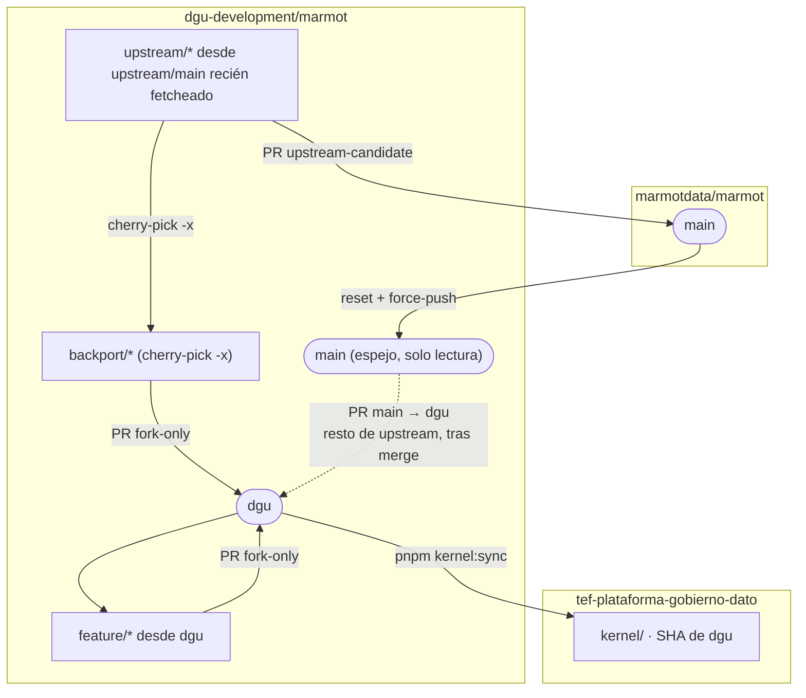

# Contribuir

Esta distribución añade marca, módulos `/dgu/*`, plugins propios e imagen. El Go de Marmot se cambia en [`dgu-development/marmot`](https://github.com/dgu-development/marmot), **no** a mano en el submódulo `kernel/`.

1. [Empieza aquí](#empieza-aquí) — qué repo tocar
2. [Entorno local](#entorno-local) — Compose, Vite, [sin contenedores](#frontend-sin-contenedores) (`pnpm start:host`)
3. [Kernel](#kernel) — `upstream-candidate` vs `fork-only`
4. [Extender](#extender) — plugin o módulo
5. [Pull requests](#pull-requests)
6. [Editor](#editor)

Agentes: [AGENTS.md](AGENTS.md). Grafo del fork: [FORK.md](https://github.com/dgu-development/marmot/blob/dgu/FORK.md).

## Empieza aquí

No subas de nivel si el inferior basta. Detalle en el [ROADMAP](docs/ROADMAP.md).

| Quieres… | Nivel | Dónde |
| --- | --- | --- |
| Marca, login, layout | A | Solo ficheros de `webOverlay` en [`infra/kernel.lock.json`](infra/kernel.lock.json). Uno nuevo: decláralo **antes** de editarlo |
| Pantalla `/dgu/<id>` | A | Módulo ([plantilla](https://github.com/dgu-development/dgu-web-module-template)); no parchear el frontend nativo |
| Textos de módulos y pie | A | `locales/` del módulo y `apps/web/src/lib/dgu/i18n/` ([ADR-003](docs/adr/003-i18n-chrome-y-cuerpos.md)) |
| Traducir UI nativa (Discover, login, …) | C | Fork: `web/marmot/messages/{en,es}.json` y `m.*()`. Aquí llega por `kernel:sync`. No editar `apps/web/messages/` |
| Conector de datos | B | Repo de plugin; lock local en `infra/extensions.lock.dev.json` |
| API, migraciones, autorización | C | Fork Marmot, luego `pnpm kernel:sync <sha>` |

| Nivel | Techo |
| --- | --- |
| **A** — este repo o `dgu-web-module-*` | Sin invariantes nuevas en el servidor |
| **B** — plugin (`plugin-sdk`, gRPC) | Solo ingesta. Ni HTTP, ni UI, ni RBAC |
| **C** — fork Marmot | Hay que poder proponerlo a upstream o marcarlo `fork-only` |

El YAML corporativo (`metamodel/dgu-core.yaml`) **nunca** va al fork. El motor genérico sí. HTTP reutilizable: `GET /api/v1/metamodel` y `PATCH /api/v1/metamodel/assets/{id}`; no anidar escrituras nuevas bajo `/api/v1/assets/{id}/`.

## Entorno local

Requisitos y `git clone`: [README](README.md#arranque).

```bash
pnpm start              # overlay :3100 + API corporativa :18080
pnpm start:host         # lo mismo sin Docker (Postgres portátil + marmot + Vite)
pnpm kernel:up          # Marmot del checkout kernel/ :18081 (sin marca)
```

| | Telefónica | Marmot vanilla |
| --- | --- | --- |
| Comando | `pnpm start` | `pnpm kernel:up` |
| Compose | [`infra/compose.dev.yaml`](infra/compose.dev.yaml) (`dgu-platform-dev`) | [`infra/compose.dev.kernel.yaml`](infra/compose.dev.kernel.yaml) (`dgu-kernel-dev`) |
| Qué construye | `Dockerfile` de esta distribución | `kernel/Dockerfile` del checkout actual |
| UI + API | <http://127.0.0.1:18080> | <http://127.0.0.1:18081> |
| Vite (HMR) | <http://127.0.0.1:3100> | `MARMOT_URL=http://127.0.0.1:18081 pnpm kernel:dev` → <http://127.0.0.1:5173> |
| Postgres (host) | `:5433` | `:5434` |

`:18080` embebe el overlay del último `--rebuild`; no es UI vanilla. `pnpm kernel:dev` **sin** `MARMOT_URL` apunta a `:18080` (mismo catálogo corporativo, útil para comparar). Para contribuir al fork, usa `:18081`.

`pnpm kernel:up -- --rebuild` reconstruye `dgu/marmot-kernel:dev`. El primer usuario de `:18081` se crea en la pantalla nativa; no usa `DGU_LOCAL_PASSWORD`. JWT por origen: hay que entrar en cada puerto.

Parar vanilla: `docker compose --env-file .env -f infra/compose.dev.kernel.yaml down`. No uses `down -v` sobre el stack corporativo.

[`compose.dev.upstream.yaml`](infra/compose.dev.upstream.yaml) sustituye el contenedor corporativo por la imagen **pública** de Marmot. No es el checkout del fork ni un segundo stack.

`pnpm start` instala, hornea módulos, levanta Compose (reconstruye si no hay imagen o pasas `--rebuild`), crea `.env` si falta y arranca Vite. `pnpm dev` es solo bake + Vite: exige que la API ya escuche en `:18080`. El `--rebuild` local no tira plugins privados de GHCR (`DGU_SKIP_EXTRA_OCI=1`). Si `DGU_LOCAL_PASSWORD` ya está en `.env`, el bootstrap no toca esa cuenta.

URL HTTPS temporal del overlay: `pnpm share` (túnel a `:3100`; `--api` va a `:18080`). La URL es pública y no es un despliegue.

### Frontend sin contenedores

Para overlay (`apps/web`) y módulos `/dgu/*` cuando Docker no está en el PC. Un comando hace bake, descarga PostgreSQL 16 (zip sin instalador), crea el cluster, compila el Marmot del pin y arranca Vite. El overlay proxifica `/api` a `127.0.0.1:18080` ([ADR-002](docs/adr/002-frontend-completo-y-distribucion.md)). No sustituye `pnpm start` ni el [Compose de producción](docs/DEPLOYMENT.md).

**Requisitos:**:
- Node ≥ 22.13 (Corepack)
- [Go 1.26](https://go.dev/doc/install) para `kernel/bin/marmot` (solo para compilar el checkout `kernel/`). No hace falta instalar Postgres ni Docker. No uses un release de `marmotdata/marmot`: el pin es el SHA de `dgu` en [`infra/kernel.lock.json`](infra/kernel.lock.json).

```bash
git submodule update --init --recursive
pnpm start:host
```

UI de trabajo: <http://127.0.0.1:3100>. `:18080` es la UI del kernel. 

Primer acceso: `admin` / `admin` (el script guarda `DGU_LOCAL_PASSWORD` en `.env` si aún no existe). Ctrl+C para Vite; API y Postgres siguen. Pararlos: `pnpm start:host -- --stop`. Recompilar Marmot: `--rebuild`.

Binarios de Postgres (cache en `infra/.tools/`, gitignore): [zip EDB sin instalador](https://www.enterprisedb.com/download-postgresql-binaries) en Windows y macOS Intel. En Linux y Apple Silicon EDB responde 403 a esos archivos; el script baja el bundle portable 16.15 de Maven Central (zonky), misma idea. Cluster propio en `infra/pg-host/` (`127.0.0.1:5432`, o `:54332` si 5432 está ocupado). `DGU_HOST_PG_BIN` apunta a un prefijo ya extraído si no quieres descargar.

Módulo `/dgu/<id>`: `{ "id", "path" }` en `infra/extensions.lock.dev.json` (copia del [`.example`](infra/extensions.lock.dev.example.json); puedes dejar `plugins` vacío) y otra vez `pnpm start:host`. Edita el repo origen, no `apps/web/src/routes/dgu/`.

| | Compose (`pnpm start`) | Host (`pnpm start:host`) |
| --- | --- | --- |
| Overlay (HMR) | :3100 | :3100 |
| API | contenedor :18080 (embed corporativo) | binario :18080 (UI del kernel) |
| Postgres | volumen Compose, host :5433 | `infra/pg-host/`, :5432 o :54332 |
| Plugins extra | `infra/plugins-dev/` → contenedor | fuera de este atajo |

Ingest y plugins quedan fuera. Sin Go no hay binario de Marmot que publicar en este repo.

```bash
pnpm test              # bake, bootstrap, i18n corporativa, compose
pnpm check:upstream    # si tocaste apps/web
pnpm build             # si tocaste apps/web
```

En el fork (Go): tests del paquete tocado; `make server-lint` / `make swagger` si aplica. `pnpm check` (`svelte-check`) no es gate: upstream no lo pasa.

## Kernel



| Sitio | Qué va ahí |
| --- | --- |
| [marmotdata/marmot](https://github.com/marmotdata/marmot) | Cambios genéricos del catálogo |
| Fork `main` | Espejo bit-a-bit de `upstream/main`, autocorregido por [`sync-upstream-main.yml`](.github/workflows/sync-upstream-main.yml) (reset + force-push). Solo para navegar/diff. **No es punto de partida de ramas ni admite PRs** ([`reject-prs-to-main.yml`](.github/workflows/reject-prs-to-main.yml) los cierra) |
| Fork **`upstream/*`** | Candidato a upstream. Nace de un `upstream/main` recién fetcheado, no del espejo local |
| Fork **`dgu`** | Lo que usa esta plataforma (reutilizable **y** lo que Marmot aún no tiene) |
| Este repo | Overlay, módulos `/dgu/*`, locks, imagen |

`kernel/` es un checkout del SHA fijado. El trabajo de Go se empuja en el fork; aquí solo se actualiza el pin.

### Puede ir a Marmot (`upstream-candidate`)

Lo que **puede** ir a Marmot se ramifica desde un **`upstream/main` recién fetcheado** (nunca del espejo local `main` ni de `dgu`) y el **mismo** parche se backportea a `dgu` por cherry-pick. No se reescribe dos veces, y la propia rama `upstream/*` **no** se abre como PR hacia `dgu`: eso arrastraría commits de upstream que `dgu` aún no tiene, o del propio fork si la rama se contaminó con un merge accidental (así se coló CODEOWNERS, plantillas de issue, `FORK.md` y `.vscode/` en la [#275](https://github.com/marmotdata/marmot/pull/275)).

1. `git fetch upstream` y rama desde `upstream/main` (nunca desde el `main` local ni desde `dgu`):
   ```bash
   git fetch upstream
   git switch -c upstream/<slug> upstream/main
   ```
2. Solo `rebase` sobre `upstream/main` para traer cambios; nunca `merge dgu` ni `merge main`. [`guard-upstream-candidate.yml`](.github/workflows/guard-upstream-candidate.yml) rechaza el push si detecta un merge commit o si la rama toca rutas fork-only (`FORK.md`, `CODEOWNERS`, `.github/ISSUE_TEMPLATE/`, `.github/PULL_REQUEST_TEMPLATE.md`, `.vscode/`).
3. PR a **marmotdata/marmot** (label `upstream-candidate`). Antes de abrirla, revisa la pestaña *Commits*: si aparece algo que no escribiste tú, no la abras.
4. Backport a **`dgu`** por cherry-pick, no por PR directa de `upstream/*` (el workflow bloquea esa PR si se intenta):
   ```bash
   git switch -c backport/<slug> origin/dgu
   git cherry-pick -x upstream/main..upstream/<slug>
   ```
   PR `fork-only` de `backport/<slug>` a `dgu`.
5. Cuando Marmot acepte: `origin/main` hace fast-forward; PR **`main` → `dgu`** para traer el resto de upstream (el parche propio ya llegó en el paso 4, así que ese PR no debería chocar con él).

### Solo nuestro (`fork-only`)

1. Rama desde `dgu`.
2. PR solo a `dgu`. Label `fork-only`.

No mezcles nombres Telefónica, YAML DGU ni overlay en un PR hacia marmotdata.

### Actualizar el pin

Tras un SHA de `dgu` revisado:

```bash
git -C kernel remote add upstream https://github.com/marmotdata/marmot   # una vez
git -C kernel fetch origin
pnpm kernel:sync <sha>    # commit de origin/dgu; no un tag flotante ni origin/main
pnpm check:upstream
```

Si también cambia la imagen pública: `pnpm kernel:sync <sha> --image ghcr.io/marmotdata/marmot:<tag>@sha256:…`. Un fichero nuevo del overlay: entra en `webOverlay` **antes** del sync. [ADR-002](docs/adr/002-frontend-completo-y-distribucion.md).

## Extender

El código vive en su repo; este core solo declara el lock y hornea.

| Qué | Plantilla | Techo |
| --- | --- | --- |
| Conector (ingesta) | [dgu-marmot-plugin-template](https://github.com/dgu-development/dgu-marmot-plugin-template) | gRPC `Validate` + `Discover` |
| Vista `/dgu/<id>` | [dgu-web-module-template](https://github.com/dgu-development/dgu-web-module-template) | Rutas Svelte aditivas; `fetchApi` / `@marmotdata/sdk` |

Hay **dos** manifiestos: [`infra/extensions.lock.json`](infra/extensions.lock.json) (imagen GHCR, en git) y `infra/extensions.lock.dev.json` (local, `{ "id", "path" }`; gitignore, se crea desde el [`.example`](infra/extensions.lock.dev.example.json)).

```json
{
  "plugins": [{ "id": "obsidian", "path": "../dgu-marmot-plugin-obsidian" }],
  "modules": [{ "id": "graph", "path": "../dgu-web-module-graph" }]
}
```

Los plugins **core** de Marmot se cargan en el primer ingest. El resto de conectores oficiales van en el lock de producción y se hornean en `/var/lib/marmot/plugins`. No montes `~/.marmot/plugins` encima de ese directorio. Ingest: pipeline en la UI o CLI; el token sale de [API Keys](http://127.0.0.1:18080/profile?tab=api-keys).

Las vistas `/dgu/*` las enlaza [`scripts/bake-extensions.mjs`](scripts/bake-extensions.mjs). Edita el repo origen; `apps/web/src/routes/dgu/<id>` no se versiona.

### Plugin

1. Plantilla y [TEMPLATE.md](https://github.com/dgu-development/dgu-marmot-plugin-template/blob/main/TEMPLATE.md) (`example` → tu `id`). Binario `marmot-plugin-<id>`.
2. `pluginsdk.Serve`. Activos con `mrn.New(tipo, provider, nombre)`. Linaje solo de relaciones de gobierno conocidas.
3. `make test`. Aquí: entrada en el lock `.dev` y `pnpm start`.
4. Release-please publica el OCI; el token entra en el lock de producción ([despliegue](docs/DEPLOYMENT.md#imagen)).

Guía: [creating-plugins](https://github.com/dgu-development/dgu-marmot-plugin-template/blob/main/docs/creating-plugins.md).

### Módulo web

1. Plantilla y [TEMPLATE.md](https://github.com/dgu-development/dgu-web-module-template/blob/main/TEMPLATE.md). `module.json` declara `id`, ruta, nav y FAB; textos en `locales/`.
2. Rutas bajo `/dgu/<id>`. Datos con `fetchApi`. La marca queda en el overlay, no en el módulo.
3. Lock `.dev` y `pnpm start` / `pnpm extensions:bake`.
4. Release-please publica el OCI; el token entra en el lock de producción.

Guía: [consuming](https://github.com/dgu-development/dgu-web-module-template/blob/main/docs/consuming.md) · [SDK](https://github.com/dgu-development/dgu-web-module-template/blob/main/docs/marmot-sdk.md).

## Pull requests

En **este** repo: ramas `codex/…`, PRs a `main`, [Conventional Commits](https://www.conventionalcommits.org/) (lo exige CI) y la [plantilla](.github/PULL_REQUEST_TEMPLATE.md).

En el **fork**: `upstream-candidate` o `fork-only`, según [Kernel](#kernel).

No subas `.env`, credenciales, notas reales ni fotos de vault.

## Editor

Cursor usa la misma configuración que VS Code. Abre la carpeta de este repo ([`.vscode/extensions.json`](.vscode/extensions.json)). Si también editas módulos y plugins, el workspace `tef-plattform.code-workspace` del directorio padre.

| Extensión | Id |
| --- | --- |
| Prettier | `esbenp.prettier-vscode` |
| Go | `golang.go` |
| Svelte | `svelte.svelte-vscode` |
| ESLint | `dbaeumer.vscode-eslint` |

Format on save con Prettier; Go con `gofmt`. `prettier.requireConfig` evita reformatear carpetas sin `.prettierrc`.

| Ámbito | Config |
| --- | --- |
| Overlay y frontend | [`apps/web/.prettierrc`](apps/web/.prettierrc) |
| UI del kernel | `kernel/web/marmot/.prettierrc` (entra por `kernel:sync`) |
| Módulos | `.prettierrc` del repo del módulo |
| `kernel/sdk/ts` | Biome |
| `**/*.go` | `gofmt` |

Estilo web: tabuladores, `singleQuote`, sin coma colgante, `printWidth` 100. Sin `pnpm --dir apps/web install`, el plugin de Svelte no formatea. Atajo: **Shift+Alt+F** o `pnpm --dir apps/web format`. El autoguardado `afterDelay` no dispara Prettier.

## Lectura siguiente

| Tema | Dónde |
| --- | --- |
| Overlay, submódulo, imagen | [ADR-002](docs/adr/002-frontend-completo-y-distribucion.md) |
| Metamodelo y ámbitos | [ADR-005](docs/adr/005-metamodelo-core-y-ambitos.md), [plan](docs/plans/20260917-metamodelo-kernel.md) |
| Contrato del checkout | [docs/kernel/advanced-metamodel.md](docs/kernel/advanced-metamodel.md) |
| Publicar | [docs/DEPLOYMENT.md](docs/DEPLOYMENT.md) |
| Pack de agentes | [.agents/README.md](.agents/README.md) |
