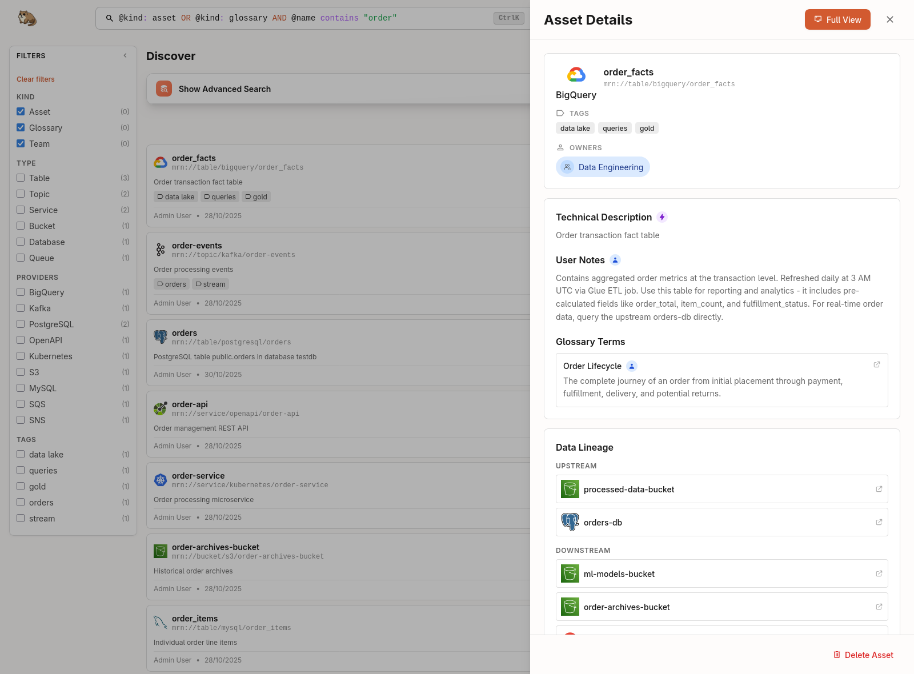

  

# Marmot

**Discover any data asset across your entire org in seconds**

_Open-source catalog for all your data assets. Search everything - tables, topics, queues, buckets, and more._

[Documentation](https://marmotdata.io/docs/introduction) • [Live Demo](https://demo.marmotdata.io) • [Deploy](https://marmotdata.io/docs/Deploy) • [Community](https://discord.gg/TWCk7hVFN4)

## What is Marmot?

Marmot is an **open-source data catalog** designed for teams who want powerful data discovery without enterprise complexity. Built with a focus on simplicity and speed, Marmot helps you catalog assets across your entire data stack - from databases and APIs to message queues and data pipelines.

Unlike traditional catalogs that require extensive infrastructure and configuration, Marmot ships as a **single binary** with an intuitive UI, making it easy to deploy and start cataloging in minutes.

### Built for Modern Data Teams

- **Deploy in Minutes**: Single binary, Docker, or Kubernetes - no complex setup required
- **Powerful Search**: Powerful query language with full-text, metadata, and boolean operators
- **Track Lineage**: Interactive dependency graphs to understand data flows and impact
- **Flexible Integrations**: CLI, REST API, Terraform, and Pulumi - catalog assets your way
- **Lightweight**: PostgreSQL-backed with minimal resource requirements

## Features

### Search Everything

Find any data asset across your entire organisation in seconds. Combine full-text search with structured queries using metadata filters, boolean logic, and comparison operators.

  <picture>
    <source media="(prefers-color-scheme: dark)" srcset="./web/docs/static/img/search-dark.png">
    <source media="(prefers-color-scheme: light)" srcset="./web/docs/static/img/search-light.png">
    
  </picture>

---

### Interactive Lineage Visualisation

Trace data flows from source to destination with interactive dependency graphs. Understand upstream and downstream dependencies, identify bottlenecks, and analyse impact before making changes.

  <picture>
    <source media="(prefers-color-scheme: dark)" srcset="./web/docs/static/img/lineage-dark.png">
    <source media="(prefers-color-scheme: light)" srcset="./web/docs/static/img/lineage-light.png">
    
  </picture>

---

### Metadata-First Architecture

Store rich metadata for any asset type. From tables and topics to APIs and dashboards.

  <picture>
    <source media="(prefers-color-scheme: dark)" srcset="./web/docs/static/img/home-dark.png">
    <source media="(prefers-color-scheme: light)" srcset="./web/docs/static/img/home-light.png">
    
  </picture>

---

### Team Collaboration

Assign ownership, document business context, and create glossaries. Keep your entire team aligned with centralised knowledge about your data assets.

  <picture>
    <source media="(prefers-color-scheme: dark)" srcset="./web/docs/static/img/team-dark.png">
    <source media="(prefers-color-scheme: light)" srcset="./web/docs/static/img/team-light.png">
    
  </picture>

## Deploy

**New to Marmot?** Follow the [Deploy](https://marmotdata.io/docs/Deploy) documentation for a guided setup.

> **Interested in exploring Marmot?** Check out the [live demo](https://demo.marmotdata.io)

## Development

See [Local Development](https://marmotdata.io/docs/Develop/local-development) for how to get started developing locally.

## Community

Join our [Discord community](https://discord.gg/TWCk7hVFN4) to:

- Get help and support
- Share feedback and ideas
- Stay updated on new features

## Contributing

All types of contributions are encouraged and valued!

**Ways to Contribute:**

- Report bugs or suggest features via [GitHub Issues](https://github.com/your-org/marmot/issues)
- Improve documentation
- Build new plugins for data sources

Before contributing, please check out the [Contributing Guide](CONTRIBUTING.md).

## License

Marmot is open-source software licensed under the [MIT License](LICENSE).
