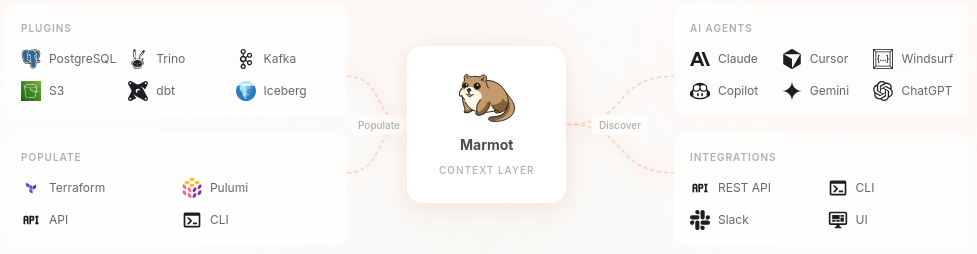

  

# Marmot

**Discover any data asset in seconds. Then let your AI do the same.**

_The open-source context layer for your AI. Catalog your tables, topics, queues and APIs then expose real metadata to your AI agents._

[Documentation](https://marmotdata.io/docs/introduction) • [Live Demo](https://demo.marmotdata.io) • [Deploy](https://marmotdata.io/docs/Deploy) • [Community](https://discord.gg/TWCk7hVFN4)

## What is Marmot?

Marmot is an **open-source data catalog** for teams who want powerful data discovery without enterprise complexity. Catalog every data asset, enrich it with the context that matters and make it accessible to your team and your AI tools.

Unlike traditional catalogs that require extensive infrastructure and configuration, Marmot ships as a **single binary** with an intuitive UI, making it easy to deploy and start cataloging in minutes.

<a href="https://www.youtube.com/watch?v=_JBcQGj_bFU">▶ Watch the 2-minute demo</a>

## Features

- **Search everything**: Find any data asset in seconds with full-text search plus structured queries, boolean logic and metadata filters.
- **Interactive lineage**: Trace data flows from source to destination and analyse impact before making changes.
- **Metadata-first**: Store rich metadata for any asset type, from tables and topics to APIs and dashboards.
- **Team collaboration**: Assign ownership, document business context and maintain shared glossaries.
- **AI-ready**: Expose certified context through MCP, the API and the UI.

  

## Deploy

**New to Marmot?** Follow the [Deploy](https://marmotdata.io/docs/Deploy) documentation for a guided setup, or try the [live demo](https://demo.marmotdata.io).

## Development

See [Local Development](https://marmotdata.io/docs/Develop/local-development) for how to get started developing locally.

## Community

Join our [Discord community](https://discord.gg/TWCk7hVFN4) for help, feedback and updates on new features.

## Contributing

All types of contributions are encouraged and valued!

- Report bugs or suggest features via [GitHub Issues](https://github.com/your-org/marmot/issues)
- Improve documentation
- Build new plugins for data sources

Before contributing, please check out the [Contributing Guide](CONTRIBUTING.md).

## License

Marmot is open-source software licensed under the [MIT License](LICENSE).
